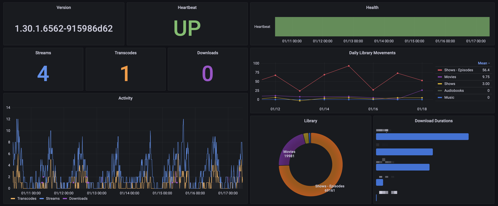

# plex-media-server-exporter

A better Prometheus exporter for Plex Media Server.

## Usage

```shell
docker run ghcr.io/axsuul/plex-media-server-exporter
```

Metrics endpoint is served by default via `http://localhost:9594/metrics`.

These environment variables can be passed into the container (defaults are in parentheses):

* `PORT` (`9594`)
* `PLEX_ADDR` (`http://localhost:32400`)
  - Plex Media Server address
* `PLEX_TOKEN`
  - Plex Media Server token
* `PLEX_TIMEOUT` (`10`)
  - How long to wait for Plex Media Server to respond
* `METRICS_PREFIX` (`plex`)
  - What to prefix metric names with
* `METRICS_MEDIA_COLLECTING_INTERVAL_SECONDS` (`300`)
  - How often to throttle collection of media metrics which can take longer to complete depending on how large of a library you have

## Metrics

Served by default via `http://localhost:9594/metrics`

```
# TYPE plex_up gauge
# HELP plex_up Server heartbeat
plex_up 1.0
# TYPE plex_info gauge
# HELP plex_info Server diagnostics
plex_info{version="1.29.2.6364-6d72b0cf6"} 1.0
# TYPE plex_media_count gauge
# HELP plex_media_count Number of media in library
plex_media_count{title="Movies",type="movie"} 19318.0
plex_media_count{title="Shows",type="show"} 2318.0
plex_media_count{title="Shows - Episodes",type="show_episode"} 66443.0
plex_media_count{title="Audiobooks",type="artist"} 17.0
plex_media_count{title="Music",type="artist"} 891.0
# TYPE plex_sessions_count gauge
# HELP plex_sessions_count Number of current sessions
plex_sessions_count{state="buffering"} 0.0
plex_sessions_count{state="paused"} 1.0
plex_sessions_count{state="playing"} 2.0
# TYPE plex_audio_transcode_sessions_count gauge
# HELP plex_audio_transcode_sessions_count Number of current sessions that are transcoding audio
plex_audio_transcode_sessions_count{state="buffering"} 0.0
plex_audio_transcode_sessions_count{state="paused"} 0.0
plex_audio_transcode_sessions_count{state="playing"} 0.0
# TYPE plex_video_transcode_sessions_count gauge
# HELP plex_video_transcode_sessions_count Number of current sessions that are transcoding video
plex_video_transcode_sessions_count{state="buffering"} 0.0
plex_video_transcode_sessions_count{state="paused"} 0.0
plex_video_transcode_sessions_count{state="playing"} 1.0
# TYPE plex_media_downloads_count gauge
# HELP plex_media_downloads_count Number of current media downloads
plex_media_downloads_count{user_id="1",username="axsuul"} 1.0
plex_media_downloads_count{user_id="2",username="hoarder"} 3.0
```

## Grafana

of what's possible with these Prometheus metrics.


